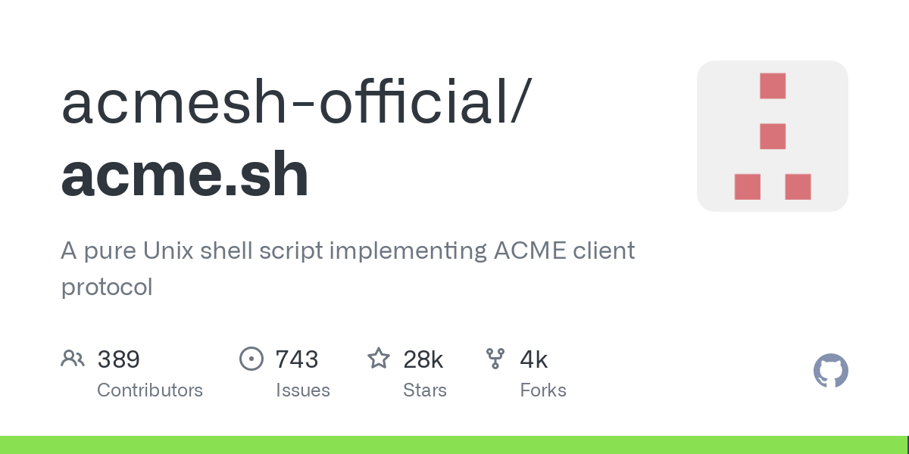

:::note 前言
作为世界上最流行的 ACME 客户端，ACME.sh 从诞生之初简介采用 lexion API 解决 SSL 的 DNS 自动化，到现在直接整合超过 140 家世界范围的动态 DNS 提供商，这离不开其受欢迎程度的原因在里面。

经过我们调研发现，ACME.sh 诞生 7 年以来，作者 [Neilpang](https://github.com/Neilpang) 处理 Issues 平均时间在 4～8 小时，获得超过2万8千赞，累计收获公开赞助不到 $2000 美金。在2020年 ACME.sh 曾获得 ZeroSSL 运营公司 ApiLayer 的赞助（金额未公开）。
:::

我们自豪的宣布，今天，我们捐助了 $1100 美金给 ACME.sh 团队，这将是我们的第一次公开捐助；同时，我们宣布将后续 HiCA 项目收入的 10% 捐赠给 ACME.sh 项目！感谢各位付费用户在 HiCA 上线后的大力支持！也感谢 [Neilpang](https://github.com/Neilpang) 持续维护给世界提供了如此好用的工具，以及他为 ACME 生态做出的巨大贡献！

我们呼吁各位用户、同行从业者，为开源事业贡献力量，为 ACME.sh 以及其他开源项目提供更多的支持！

> ACME.sh：[https://github.com/acmesh-official/acme.sh](https://github.com/acmesh-official/acme.sh)。
